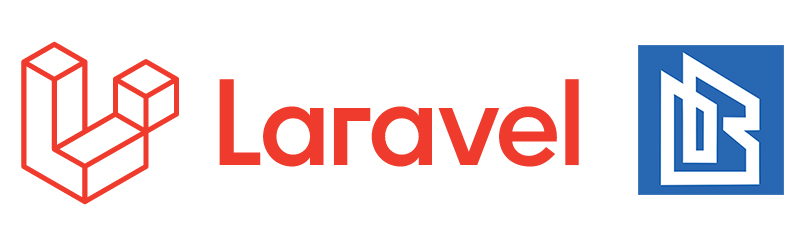

## Source Code:

Source code for training on creating job portals using the [Laravel Framework (version 6)](https://laravel.com/) and PostgreSQL ](https://www.postgresql.org//) by [Biraldino Studio](https://www.youtube.com/c/BiraldinoStudio)

## Entities at this source:
- Company
- Job seekers
- Admin

## Company page features:
- Authentication and authorization
- Add recruitment officers
- Post job vacancies
- Accept job applications
- Selection of job applicants
- Receive and send messages with job applicants
- Post articles

## Job seeker page features:
- Authentication and authorization
- Apply for job
- Receive job application status
- Recommended job vacancies
- Receive and send messages with the Company
- Post articles

## Social Media
[LinkedIn,](https://www.linkedin.com/in/biraldino-studio-ab503a1bb/)
[Facebook,](https://www.facebook.com/biraldinostudio/)
[Telegram,](https://t.me/BiraldinoStudio)
[Instagram,](https://www.instagram.com/biraldino_studio/)
[Twitter,](https://twitter.com/BiraldinoS)
[Shutterstock](https://www.shutterstock.com/g/BiraldinoStudio)

## Submission of Cooperation

Submission of cooperation or partners, please send an email to the official Biraldino Studio: [official.biraldinostudio@gmail.com](mailto:official.biraldinostudio@gmail.com).

